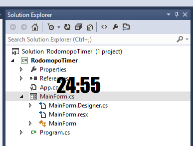

25minutes
=========

Pomodoro Timer

Snapshots
========

* Before starting

* Started

Features
========

* You can start a new 25 minutes Pomodoro session by clicking Start button. That's all.
* When your mouse cursor leaves the window, it hides the UI and becomes topmost.
* When the curser enters the window, it shows the UI.
* When it times out, the app moves randomly until the cursor enters the window.

Download
=========

* This is the [executable](RodomopoTimer/bin/Release/RodomopoTimer.exe).

Etc.
=========

* Tested on only my Windows 8 PC.
